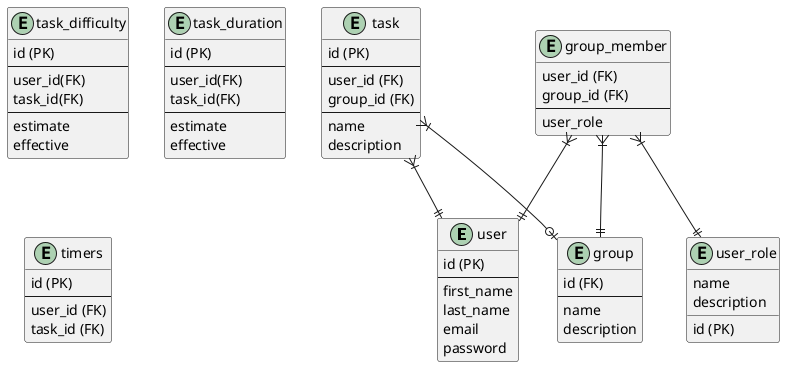

```plantuml
@startuml

entity user {
    id (PK)
    --
    first_name
    last_name
    email
    password
}

entity user_role {
    id (PK)
    name
    description
}

together {
    entity group {
        id (FK)
        --
        name
        description
    }
    
    entity group_member {
        user_id (FK)
        group_id (FK)
        --
        user_role
    } 
}


together {

    entity task {
        id (PK)
        --
        user_id (FK)
        group_id (FK)
        --
        name
        description
    }

    entity task_difficulty {
        id (PK)
        --
        user_id(FK)
        task_id(FK)
        --
        estimate
        effective
    }

    entity task_duration {
        id (PK)
        --
        user_id(FK)
        task_id(FK)
        --
        estimate
        effective
    }

    entity timers {
        id (PK)
        --
        user_id (FK)
        task_id (FK)
    }

}


group_member }|--|| user
group_member }|--|| group
group_member }|--|| user_role

task }|--|| user
task }|--o| group


@enduml
```