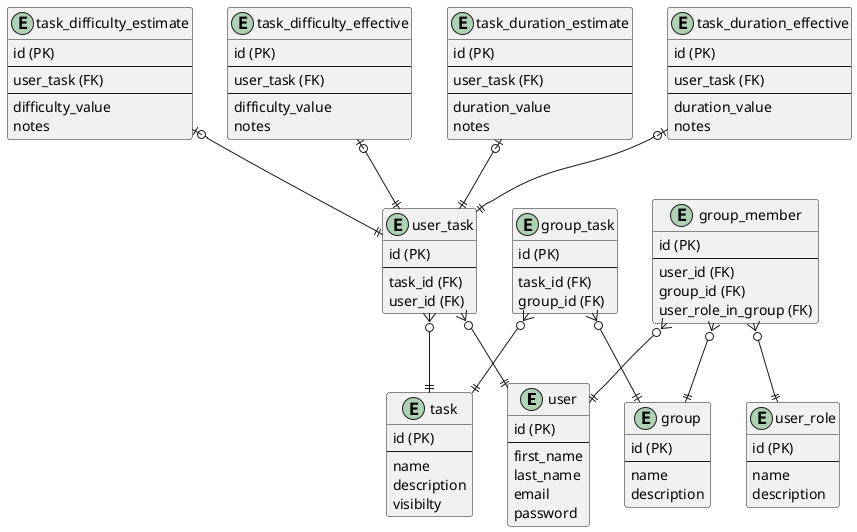

```plantuml
@startuml

entity user {
    id (PK)
    --
    first_name
    last_name
    email
    password
}

entity task {
    id (PK)
    --
    name
    description
    visibilty
}

entity group {
    id (PK)
    --
    name
    description
}

entity user_task {
    id (PK)
    --
    task_id (FK)
    user_id (FK)
}

entity group_task {
    id (PK)
    --
    task_id (FK)
    group_id (FK)
}


entity group_member {
    id (PK)
    --
    user_id (FK)
    group_id (FK)
    user_role_in_group (FK)
}

entity user_role {
    id (PK)
    --
    name
    description
}

entity task_difficulty_estimate {
    id (PK)
    --
    user_task (FK)
    --
    difficulty_value
    notes
}
entity task_difficulty_effective {
    id (PK)
    --
    user_task (FK)
    --
    difficulty_value
    notes
}

entity task_duration_estimate {
    id (PK)
    --
    user_task (FK)
    --
    duration_value
    notes
}
entity task_duration_effective {
    id (PK)
    --
    user_task (FK)
    --
    duration_value
    notes
}

user_task }o--|| user
user_task }o--|| task

task_duration_estimate |o--|| user_task
task_duration_effective |o--|| user_task
task_difficulty_estimate |o--|| user_task
task_difficulty_effective |o--|| user_task

group_member }o--|| user
group_member }o--|| group
group_member }o--|| user_role

group_task }o--|| group
group_task }o--|| task


@enduml
```